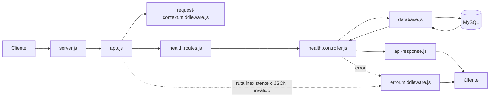

# Explicación de `sendSuccess`, `health.routes.js`, middlewares, controller, database y utilidades

Este documento explica, con enfoque pedagógico, varios archivos base del backend de **StudentFlow**.

Incluye:

1. la función `sendSuccess`;
2. cada línea de [health.routes.js](/D:/Downloads/camacho/2026B/programacionV/studentFlow_back/src/routes/health.routes.js);
3. cada función de estos archivos:
   - [error.middleware.js](/D:/Downloads/camacho/2026B/programacionV/studentFlow_back/src/middlewares/error.middleware.js)
   - [request-context.middleware.js](/D:/Downloads/camacho/2026B/programacionV/studentFlow_back/src/middlewares/request-context.middleware.js)
   - [health.controller.js](/D:/Downloads/camacho/2026B/programacionV/studentFlow_back/src/controllers/health.controller.js)
   - [database.js](/D:/Downloads/camacho/2026B/programacionV/studentFlow_back/src/config/database.js)
   - [api-response.js](/D:/Downloads/camacho/2026B/programacionV/studentFlow_back/src/utils/api-response.js)

---

## 1. Explicación de `function sendSuccess`

Archivo relacionado:

- [api-response.js](/D:/Downloads/camacho/2026B/programacionV/studentFlow_back/src/utils/api-response.js)

Función:

```js
export function sendSuccess(response, data, statusCode = 200, meta) {
  const payload = {
    success: true,
    data
  };

  if (meta) {
    payload.meta = meta;
  }

  return response.status(statusCode).json(payload);
}
```

### ¿Qué hace en términos generales?

`sendSuccess` sirve para construir respuestas exitosas del backend con un formato uniforme.

En vez de escribir manualmente una respuesta JSON en cada controller, esta función la arma por nosotros.

### ¿Qué hace en términos específicos?

Recibe:

- `response`: el objeto de respuesta de Express;
- `data`: la información que se le quiere enviar al cliente;
- `statusCode`: el código HTTP, que por defecto es `200`;
- `meta`: información adicional opcional.

Luego construye un objeto así:

```json
{
  "success": true,
  "data": ...
}
```

Y si existe `meta`, lo agrega:

```json
{
  "success": true,
  "data": ...,
  "meta": ...
}
```

Finalmente envía la respuesta al cliente.

### ¿Para qué sirve?

Sirve para:

- estandarizar respuestas;
- evitar repetir código;
- hacer más fácil el trabajo del frontend;
- mantener consistencia entre módulos.

### Ejemplo de uso

```js
return sendSuccess(response, materia);
```

o:

```js
return sendSuccess(response, materias, 200, meta);
```

---

## 2. Explicación línea por línea de `health.routes.js`

Archivo:

- [health.routes.js](/D:/Downloads/camacho/2026B/programacionV/studentFlow_back/src/routes/health.routes.js)

Código:

```js
import { Router } from "express";
import { getHealth } from "../controllers/health.controller.js";

const router = Router();

router.get("/", getHealth);

export default router;
```

### Línea 1

```js
import { Router } from "express";
```

Importa `Router` desde Express.

Sirve para crear un conjunto modular de rutas, separado de la aplicación principal.

### Línea 2

```js
import { getHealth } from "../controllers/health.controller.js";
```

Importa la función `getHealth` desde el controller.

Esa función será la que responda la petición cuando alguien llame a esta ruta.

### Línea 3

Línea en blanco.

Separa visualmente imports y definición del router.

### Línea 4

```js
const router = Router();
```

Crea una instancia del router de Express.

Este objeto `router` es el que se usará para definir rutas como `GET`, `POST`, etc.

### Línea 5

Línea en blanco.

Separa creación del router y definición de rutas.

### Línea 6

```js
router.get("/", getHealth);
```

Define una ruta `GET` sobre la raíz del router.

Eso significa:

- si este router se monta en `/api/v1/health`;
- entonces esta línea atiende `GET /api/v1/health`.

Cuando llegue esa petición, Express ejecutará la función `getHealth`.

### Línea 7

Línea en blanco.

Separa la definición de rutas y la exportación final.

### Línea 8

```js
export default router;
```

Exporta el router para que pueda ser importado y usado en `app.js`.

Sin esta línea, el archivo existiría, pero no podría integrarse en la aplicación principal.

---

## 3. Explicación de cada función de `error.middleware.js`

Archivo:

- [error.middleware.js](/D:/Downloads/camacho/2026B/programacionV/studentFlow_back/src/middlewares/error.middleware.js)

### `notFoundHandler`

Código:

```js
export function notFoundHandler(_request, _response, next) {
  const error = new Error("Ruta no encontrada");
  error.statusCode = 404;
  error.code = "NOT_FOUND";
  next(error);
}
```

#### ¿Qué hace en términos generales?

Se encarga de producir un error cuando el cliente pide una ruta que no existe.

#### ¿Qué hace específicamente?

1. Crea un error nuevo.
2. Le asigna mensaje `"Ruta no encontrada"`.
3. Le asigna `statusCode = 404`.
4. Le asigna `code = "NOT_FOUND"`.
5. Envía ese error al siguiente middleware usando `next(error)`.

#### ¿Para qué sirve?

Sirve para que el backend responda ordenadamente cuando una ruta no está definida.

---

### `errorHandler`

Código:

```js
export function errorHandler(error, _request, response, _next) {
  const isJsonSyntaxError = error instanceof SyntaxError && error.status === 400 && "body" in error;
  const statusCode = isJsonSyntaxError ? 400 : error.statusCode || 500;
  const code = isJsonSyntaxError
    ? "INVALID_JSON"
    : error.code || (statusCode === 404 ? "NOT_FOUND" : "INTERNAL_ERROR");
  const message = isJsonSyntaxError
    ? "El cuerpo JSON enviado no es válido."
    : error.message || "Error interno del servidor";

  response.status(statusCode).json({
    success: false,
    error: {
      code,
      message
    }
  });
}
```

#### ¿Qué hace en términos generales?

Es el middleware central de errores del backend.

#### ¿Qué hace específicamente?

1. Revisa si el error corresponde a JSON mal formado.
2. Define qué `statusCode` debe devolverse.
3. Define qué `code` debe devolverse.
4. Define qué `message` debe devolverse.
5. Responde al cliente en formato JSON.

#### ¿Para qué sirve?

Sirve para que todos los errores del backend salgan con estructura uniforme.

---

## 4. Explicación de cada función de `request-context.middleware.js`

Archivo:

- [request-context.middleware.js](/D:/Downloads/camacho/2026B/programacionV/studentFlow_back/src/middlewares/request-context.middleware.js)

### `attachTemporaryUser`

Código:

```js
export function attachTemporaryUser(request, _response, next) {
  request.user = {
    id: 1
  };

  next();
}
```

#### ¿Qué hace en términos generales?

Inyecta un usuario temporal en cada petición.

#### ¿Qué hace específicamente?

1. Crea la propiedad `request.user`.
2. Le asigna un objeto con `id: 1`.
3. Llama a `next()` para que la petición continúe.

#### ¿Para qué sirve?

Sirve para simular autenticación mientras todavía no existe login real.

Gracias a esto, otros módulos pueden trabajar como si la petición ya tuviera un usuario asociado.

---

## 5. Explicación de cada función de `health.controller.js`

Archivo:

- [health.controller.js](/D:/Downloads/camacho/2026B/programacionV/studentFlow_back/src/controllers/health.controller.js)

### `getHealth`

Código:

```js
export async function getHealth(_request, response, next) {
  try {
    await checkDatabaseConnection();

    response.status(200).json({
      success: true,
      data: {
        status: "ok",
        database: "connected"
      }
    });
  } catch (error) {
    next(error);
  }
}
```

#### ¿Qué hace en términos generales?

Responde al endpoint de salud del backend.

#### ¿Qué hace específicamente?

1. Intenta comprobar la conexión con MySQL.
2. Si todo sale bien, responde:

```json
{
  "success": true,
  "data": {
    "status": "ok",
    "database": "connected"
  }
}
```

3. Si algo falla, envía el error al middleware central.

#### ¿Para qué sirve?

Sirve para comprobar rápidamente si:

- el backend está vivo;
- la base de datos responde.

---

## 6. Explicación de cada función de `database.js`

Archivo:

- [database.js](/D:/Downloads/camacho/2026B/programacionV/studentFlow_back/src/config/database.js)

### `pool`

Código:

```js
export const pool = mysql.createPool({
  host: process.env.DB_HOST || "localhost",
  port: Number(process.env.DB_PORT) || 3306,
  database: process.env.DB_NAME || "studentflow",
  user: process.env.DB_USER || "studentflow_user",
  password: process.env.DB_PASSWORD || "",
  waitForConnections: true,
  connectionLimit: 10,
  queueLimit: 0
});
```

#### ¿Qué hace en términos generales?

Crea un pool de conexiones hacia MySQL.

#### ¿Qué hace específicamente?

Configura:

- host;
- puerto;
- base de datos;
- usuario;
- contraseña;
- cantidad de conexiones permitidas;
- comportamiento de espera.

#### ¿Para qué sirve?

Sirve para reutilizar conexiones y permitir que distintos módulos accedan a la base sin abrir una conexión nueva cada vez.

---

### `checkDatabaseConnection`

Código:

```js
export async function checkDatabaseConnection() {
  const connection = await pool.getConnection();
  try {
    await connection.ping();
  } finally {
    connection.release();
  }
}
```

#### ¿Qué hace en términos generales?

Comprueba que el backend puede conectarse realmente a MySQL.

#### ¿Qué hace específicamente?

1. Pide una conexión al pool.
2. Hace `ping()` a la base.
3. Pase lo que pase, libera la conexión con `release()`.

#### ¿Para qué sirve?

Sirve como prueba rápida de conectividad, especialmente útil para el endpoint `health`.

---

## 7. Explicación de cada función de `api-response.js`

Archivo:

- [api-response.js](/D:/Downloads/camacho/2026B/programacionV/studentFlow_back/src/utils/api-response.js)

### `sendSuccess`

Ya fue explicada al inicio, pero en resumen:

- arma respuestas exitosas;
- opcionalmente agrega `meta`;
- devuelve el resultado como JSON.

---

### `sendNoContent`

Código:

```js
export function sendNoContent(response) {
  return response.status(204).send();
}
```

#### ¿Qué hace en términos generales?

Devuelve una respuesta exitosa sin contenido.

#### ¿Qué hace específicamente?

1. Usa el objeto `response`.
2. Envía el código HTTP `204`.
3. No envía body.

#### ¿Para qué sirve?

Sirve para operaciones como borrado exitoso donde no hace falta devolver un objeto JSON.

---

## 8. Diagrama simple de relación entre estos archivos



---

## 9. Cierre

Estos archivos son pequeños, pero muy importantes para enseñar backend porque muestran ideas fundamentales:

- cómo arranca una ruta;
- cómo se prepara una petición;
- cómo se comprueba una conexión;
- cómo se responde bien;
- y cómo se responde cuando algo falla.

Entender bien estos archivos ayuda mucho a comprender el resto del backend.
